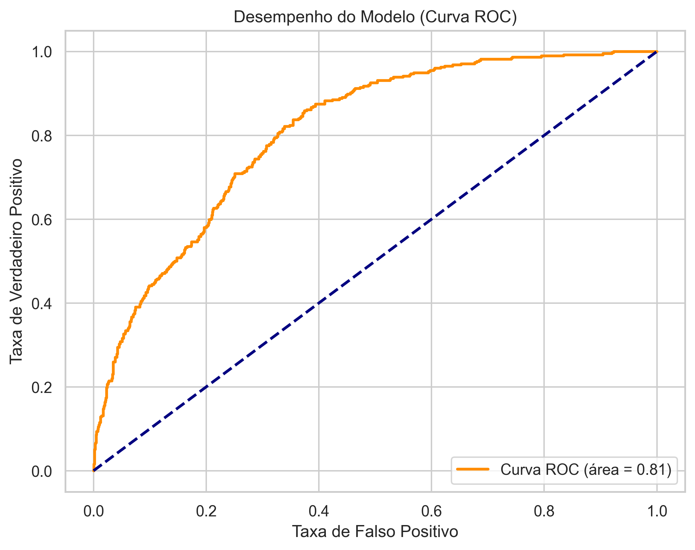
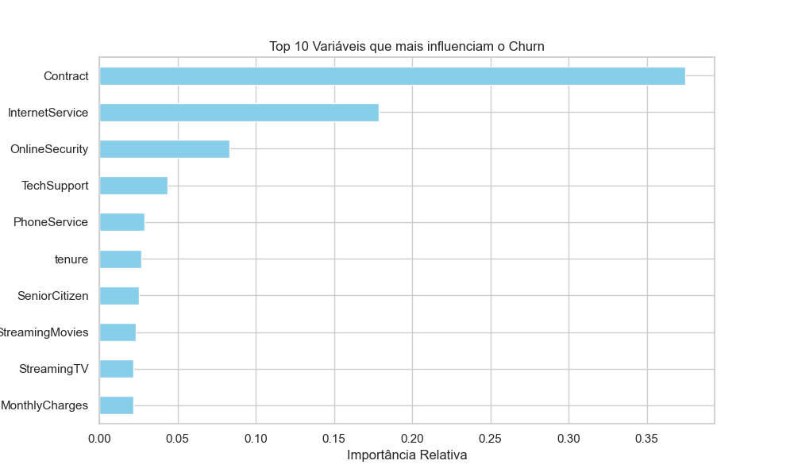

# churn-prediction-ml

The ROC Curve shows how well the model distinguishes between customers who churn and those who stay.

With an AUC of 0.81, the model has a strong ability to separate both groups, which makes it useful for targeting retention strategies more effectively.

The Feature Importance plot highlights which variables had the biggest impact on the model.

'Contract' stands out as the main driver, indicating that customers on month-to-month plans are more likely to churn.

Other relevant factors include 'Internet Service' and 'Online Security', reinforcing the importance of customer experience and service structure.

# Customer Churn Prediction

This project focuses on predicting customer churn using machine learning and understanding the main factors behind it.

## Objective

- Predict which customers are more likely to churn  
- Identify the key variables influencing churn  
- Generate insights that can support business decisions  

## Model

- XGBoost classifier  
- AUC: ~0.81  

## Key Findings

- Customers on monthly contracts are more likely to churn  
- Lack of tech support is linked to higher churn  
- Manual payment methods show higher churn rates  

## Tech Stack

Python | Pandas | Scikit-learn | XGBoost | Matplotlib

## Notes

The goal of this project is not only to build a model, but also to understand the problem from a business perspective and suggest possible actions to reduce churn.

Machine learning model to predict customer churn and generate actionable business insights.
